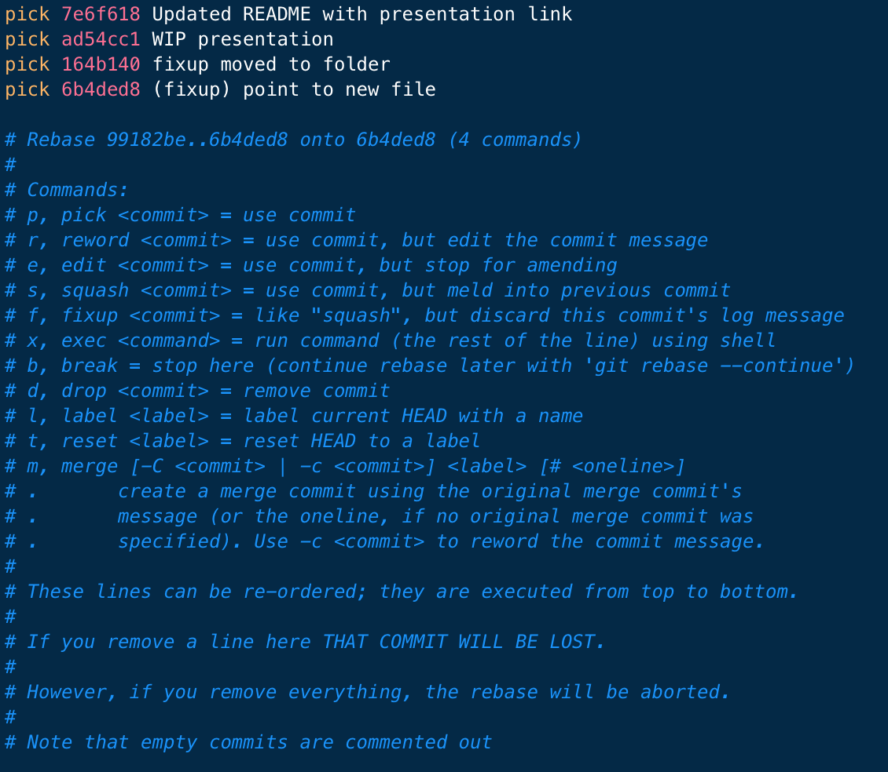

# Creating Great PRs
## Philippe Casgrain
### Senior Staff Software Developer, LightspeedHQ

Pull Requests (PRs) are one of the fundamental building blocks of software development. In this Tech Talk, we'll go over elements of great PRs and show you how to improve your own PRs by demystifying interactive rebases and staging changes.

---

## Agenda

* Elements of a great PR
* Help yourself with the right tools
* `git rebase --interactive`, the multi-tool of the `git` world
* Re-arranging a problematic PR
* Merging a good PR

---

# First things first

Remember that a PR is a _conversation_. It is about getting feedback from your peers, and discussing that feedback. 

You don't have to do everything that the reviewer says, in fact sometimes the reviewer is just looking for an answer to see if you've thought about something.

^ Laying out some ground rules

---

# Guiding principles

* A PR is a collection of one or more commits
* Each commit should be as small as it can be, but no smaller
  * Individual unit of change
  * Should not break the build by itself (`git bisect`)
  * Refactoring commits should be isolated
* Each commit message should be associated with a Jira ticket
  * Subject line is short
  * Details in the commit message

^Break down each commit to a functional, self-contained bit of code. Each commit builds on the next one, together they tell the story of what your PR is doing.
Remember that the reviewer is likely to come in cold. Having small digestible chunks with good commit messages is a lot easier to approach than a "wall of text".
Refactoring commits: anything that is a commit that contains no functional changes. For instance, renaming a variable or a class, re-arranging files in a project, etc. 
Jira tickets are extremely important as the capture metadata about the commits, such as why we are doing this in the first place. 

^Hopefully can include a word about disagreements
  
---

# Your best foot forward

When creating a PR, you are telling your colleagues "I think this is as good a solution as I can create for this issue".

Even if you're not sure, remember that a PR is a discussion.

Make sure that when you add reviewers, all the commits are ready to review:

* No missing code
* No "Work in progress"
* CI shows a green build

(Yes, Draft PRs are possible but out-of-scope for this presentation.)

^I believe that we all want what ends up in the main branch to be the best commits we can create. Remember that people will read this code in the future (maybe you, too!) so having it as good as you can make it is the way to go.

^Also remember that you will grow as a programmer. For instance, I think I'm an OK programmer. But me from two years ago is a moron, while me two years from now is a genius! Perspective matters.

---

# The right tools

* Git Tower
* Terminal.app
* Text editor with a command-line interface
  * `echo "EDITOR='mate -w'; export EDITOR" >> ~/.zshrc`
  * `bbedit`, `xed`, `code`, `subl`, etc...

---

# `git rebase --interactive`

The Swiss Army Chainsaw in your toolkit

^Here we quickly go over a UI that only a parent could love

---

# Problematic PRs

^Here we switch to a live demo using this repo

---

# Merging your PR

^Another live demo where we go through the process of merging a PR that has three commits, then a bunch of "fixup" commits

---

# Thank you!

## Any questions?
